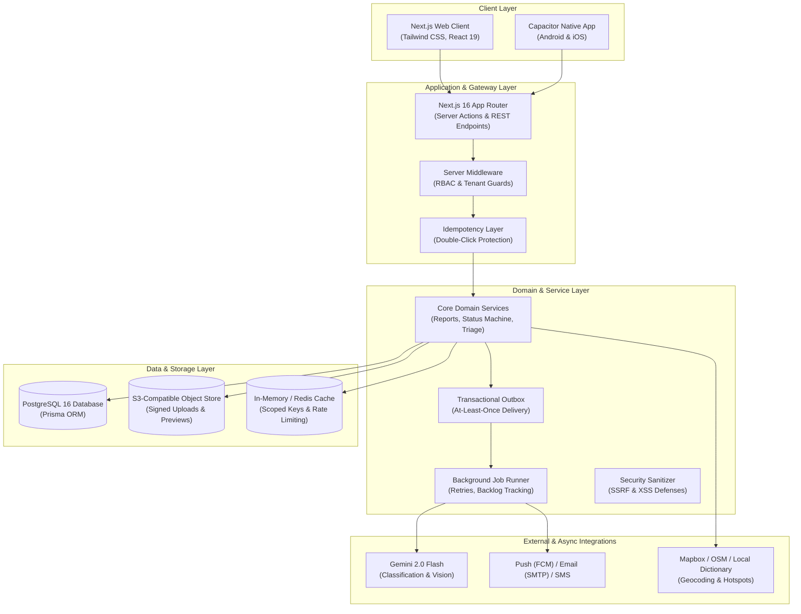
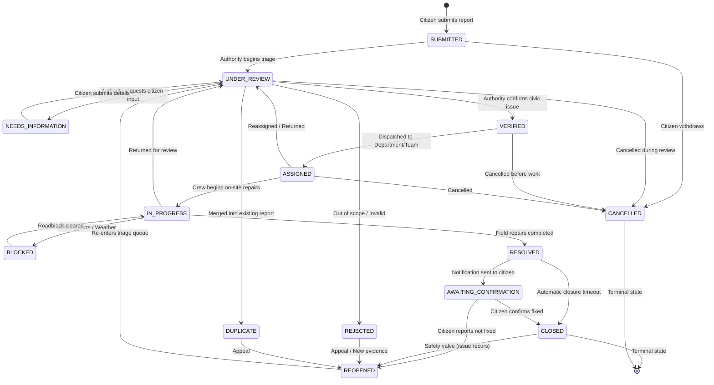

# Chigir Ale — System Architecture & Engineering Blueprint

**Specification Compliance:** Sections 162 (Documentation Requirements), 72–74 (Architecture & Transactions), 8–9 (Lifecycle State Machine), 43–44 (Mobile & Offline Architecture), 155–156 (Transactional Outbox), and 172–173 (Final Product Flow).

---

## 1. High-Level System Architecture

Chigir Ale is built as a unified civic infrastructure platform using a modern, scalable full-stack TypeScript architecture:

---

## 2. Core Report Lifecycle State Machine (Spec §8 & §9)

Every civic infrastructure report follows an authoritative finite state machine managed exclusively by `ReportStatusService`:

---

## 3. Asynchronous Decoupling & Reliability Patterns

### 3.1 Transactional Outbox Pattern (Spec §155 & §156)
To prevent dual-write inconsistencies between PostgreSQL and external notification/AI services, all domain state changes record events in the `outbox_events` table within the same ACID database transaction:
1. Status change committed in `reports` + `report_events` + `outbox_events` atomically.
2. Background worker drains `outbox_events` and dispatches to subscribers.
3. At-least-once delivery guarantee with exponential backoff on retries.

### 3.2 Idempotency Layer (Spec §101)
Every state-mutating request accepts an `Idempotency-Key` or client-generated submission key:
- First request acquires the key (`NEW`) and begins processing.
- Concurrent identical requests receive `PENDING`, preventing duplicate reports or double-clicks.
- Replayed requests return the original cached response with status `COMPLETED`.

### 3.3 Fail-Safe Provider Isolation (Spec §74)
- **AI Failures:** If external AI classification is slow or fails, the report is still persisted in `SUBMITTED` state and queued for manual staff review.
- **Notification Failures:** Push or email provider outages are captured gracefully and retried via the outbox without disrupting the user flow.
- **Geocoding Failures:** If map geocoding fails, the system automatically falls back to an internal dictionary of Addis Ababa sub-cities and landmarks.

---

## 4. Cross-Platform Mobile & Offline Architecture (Spec §43 & §44)

The application supports native iOS and Android deployment via Capacitor:
- **Shared Codebase:** 100% shared React/Next.js business logic and UI components.
- **Offline Draft Preservation:** Unfinished reports are continuously saved to local storage with timestamping.
- **Camera & Location Plugins:** Native camera evidence capture and GPS geolocation with fallback coordinates when permissions are denied.
- **Anti-Fraud Rule:** The mobile app **NEVER** displays a report as "submitted" until the server returns an authoritative public reference number (`CHI-YYYY-NNNNNN`). Disconnected reports remain clearly marked as "Pending Sync".

---

## 5. Security & Multi-Tenant Isolation (Spec §7 & §79)

- **Authentication:** Auth.js v5 with bcrypt hashed passwords (`cost=12`) and JWT/session cookies.
- **Organization Scoping:** Every authority query strictly enforces `organizationId` foreign key filters.
- **SSRF & XSS Defenses:** `SanitizerService` validates all outbound URLs against RFC 1918 private subnets and scrubs malicious script tags from all user text inputs.
- **Append-Only Audit Journal:** `audit_logs` records every mutation with actor, action, and JSON state diffs. Application code has no update or delete permissions on this table.
