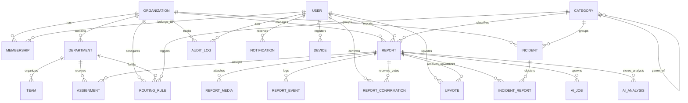

# Chigir Ale — Database Architecture & Data Dictionary

**Specification Compliance:** Sections 164 (Database Documentation), 52–71 (Domain Entities), 7.3 (Multi-Tenant Isolation), 106 (Migration Strategy), 107 (Seed Data), and 125 (Disaster Recovery).

---

## 1. Entity-Relationship Architecture

The diagram below visualizes the core relational domain model implemented in PostgreSQL via Prisma:



---

## 2. Core Domain Entities & Schemas

### 2.1 Multi-Tenant & Identity
- **`User` (`users`):** Stores identity, bcrypt password hash, phone number, language preference (`en`, `am`), and account status (`ACTIVE`, `SUSPENDED`, `DEACTIVATED`).
- **`Organization` (`organizations`):** Top-level tenant container (e.g. `Addis Ababa City Administration`). Identified by unique slug.
- **`Membership` (`memberships`):** Enforces user roles within organizations (`CITIZEN` through `PLATFORM_ADMIN`). Unique per `[userId, organizationId]`.
- **`Department` (`departments`):** Municipal branch (e.g. Roads & Civil Infrastructure, Water & Sewerage Authority).
- **`Team` (`teams`):** Field crews or specialized units inside a department.

### 2.2 Incident Management & Reports
- **`Category` (`categories`):** Hierarchical taxonomy of civic infrastructure issues (Infrastructure, Utilities, Public Services).
- **`Report` (`reports`):** Central domain entity with authoritative public reference (`CHI-YYYY-NNNNNN`), geographic coordinates, severity, status, and reporter link.
- **`ReportMedia` (`report_media`):** Evidence storage pointers (images, audio, video) referencing object storage keys and MIME metadata.
- **`ReportEvent` (`report_events`):** Chronological audit trail of lifecycle progression with visibility levels (`PUBLIC`, `INTERNAL`, `SYSTEM`).
- **`Assignment` (`assignments`):** Departmental and staff dispatch records with assignment timestamps and reassignment history.
- **`ReportConfirmation` (`report_confirmations`):** Citizen verification votes ("I'm experiencing this too") enforcing single vote per citizen per report.
- **`Upvote` (`upvotes`):** Citizen community priority votes with toggle support and unique constraints.
- **`Incident` (`incidents`):** Parent clusters grouping multiple reports into a coordinated municipal work project.
- **`IncidentReport` (`incident_reports`):** Join table linking reports to incidents with relationship type (`PRIMARY`, `DUPLICATE`, `RELATED`).

### 2.3 Operations, Security & Resilience
- **`RoutingRule` (`routing_rules`):** Automated dispatch rules mapping category and district to responsible department.
- **`Notification` (`notifications`):** In-app notification inbox with read state tracking.
- **`Device` (`devices`):** Native push notification tokens (Capacitor FCM / APNs).
- **`AuditLog` (`audit_logs`):** Strictly append-only compliance journal recording before/after JSON states. Never updated or deleted.
- **`OutboxEvent` (`outbox_events`):** Transactional outbox table guaranteeing at-least-once asynchronous event delivery.
- **`IdempotencyKey` (`idempotency_keys`):** Distributed operation locks preventing duplicate report creation and double-clicks.

---

## 3. Enumeration Reference

| Enum | Permitted Values | Domain Context |
|---|---|---|
| `MembershipRole` | `CITIZEN`, `FIELD_WORKER`, `STAFF`, `ANALYST`, `DEPARTMENT_MANAGER`, `ORG_ADMIN`, `PLATFORM_ADMIN` | RBAC access levels (Spec §6) |
| `ReportStatus` | `SUBMITTED`, `UNDER_REVIEW`, `NEEDS_INFORMATION`, `VERIFIED`, `REJECTED`, `DUPLICATE`, `ASSIGNED`, `IN_PROGRESS`, `BLOCKED`, `RESOLVED`, `AWAITING_CONFIRMATION`, `CLOSED`, `REOPENED`, `CANCELLED` | Complete report state machine (Spec §8–9) |
| `Severity` | `LOW`, `MEDIUM`, `HIGH`, `CRITICAL` | Issue impact priority (Spec §12) |
| `OrganizationType` | `GOVERNMENT`, `UTILITY`, `MUNICIPALITY`, `NGO`, `PRIVATE`, `PLATFORM` | Tenant organizational classification |
| `MediaType` | `IMAGE`, `VIDEO`, `AUDIO`, `DOCUMENT` | Evidence file classification (Spec §36) |
| `EventVisibility` | `PUBLIC`, `INTERNAL`, `SYSTEM` | Report event visibility scoping |
| `FeedbackResult` | `CONFIRMED_FIXED`, `NOT_FIXED` | Citizen post-resolution verification (Spec §29) |
| `AIJobStatus` | `PENDING`, `PROCESSING`, `COMPLETED`, `FAILED`, `CANCELLED` | Background AI processing queue (Spec §65) |
| `DevicePlatform` | `IOS`, `ANDROID`, `WEB` | Native device push tokens (Spec §70) |

---

## 4. Multi-Tenant Isolation Strategy (Spec §7.3)

Multi-tenancy is enforced through strict application-layer and query-layer isolation:
1. **Explicit Scoping:** Every authority query strictly filters on `organizationId`. An authority member of Organization A cannot view or modify reports belonging to Organization B.
2. **Citizen Anonymity / Neutrality:** Citizens submit reports globally; initial routing rules assign reports to the responsible organization based on category and district geometry.
3. **Foreign Key Integrity:** Prisma schema enforces relational cascades and integrity constraints at the database engine level.

---

## 5. Indexing Strategy & Performance (Spec §74 & §113)

To ensure sub-100ms response times across millions of records:

- **Public References:** Unique index on `reports(public_reference)` for instant lookups (`CHI-YYYY-NNNNNN`).
- **Geographic Queries:** Spatial B-tree indices on `reports(latitude)` and `reports(longitude)` to accelerate radius and bounding box searches.
- **Status & Triage:** Compound indices on `reports(status, created_at)` for responsive authority queues.
- **Reporter History:** Index on `reports(reporter_id)` for the citizen dashboard.
- **Audit Logging:** Indices on `audit_logs(entity_type, entity_id)` for audit trail reconstruction.
- **Outbox Polling:** Index on `outbox_events(processed_at, created_at)` for high-throughput batch event dispatch.
- **Idempotency Locks:** Unique index on `idempotency_keys(key)` ensuring concurrent request blocking.

---

## 6. Migration & Deployment Strategy (Spec §106)

1. **Development Migrations:**
   ```bash
   npx prisma migrate dev --name <migration_name>
   ```
   Generates reproducible SQL migration scripts under `prisma/migrations/`.

2. **Production Migrations:**
   ```bash
   npx prisma migrate deploy
   ```
   - Automatically runs pending migrations in production deployment pipelines.
   - **Zero Destructive Sync:** `prisma db push` is strictly banned in production environments.

---

## 7. Backup & Disaster Recovery Strategy (Spec §125)

- **Recovery Point Objective (RPO):** Maximum **1 hour** of allowable data loss. Enforced via automated continuous PostgreSQL Write-Ahead Log (WAL) archiving.
- **Recovery Time Objective (RTO):** Maximum **4 hours** to restore full service from cold backup.
- **Backup Verification:** Automated weekly restore drill to an isolated test database to verify backup image integrity.
- **Data Retention:** Audit logs retained for 7 years per statutory compliance (`RetentionService`).
